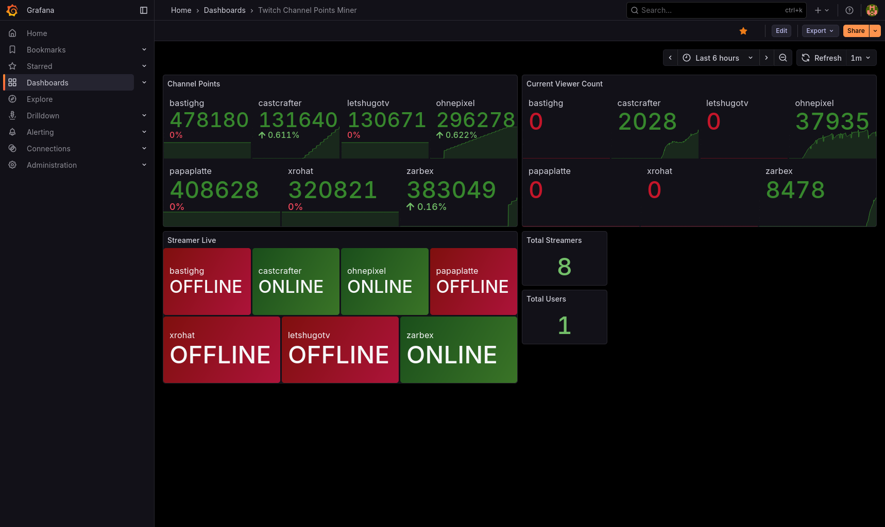

# go-twitch-channel-point-miner

Channel point miner for Twitch written in Go.

## Usage

### Using Docker

Download the `tcpm.example.yaml` and rename it to `tcpm.yaml`:

```bash
wget https://raw.githubusercontent.com/le0developer/go-twitch-channel-point-miner/master/tcpm.example.yaml -O tcpm.yaml
```

Adjust the configuration to your needs.

Create an empty persistence file: `echo "{}" >> persistent.json`.

Create a `docker-compose.yml` file:

```yaml
services:
  tcpm:
    image: ghcr.io/le0developer/go-twitch-channel-point-miner:latest
    restart: unless-stopped
    command: ["run", "--login"]
    volumes:
      - ./tcpm.yaml:/tcpm.yaml
      - ./persistent.json:/persistent.json
      # The container does not have its own certificate store, so you'll need to mount the host's certificate store
      - /etc/ssl/certs:/etc/ssl/certs:ro
```

Then deploy the container:

```bash
docker compose up -d
```

Follow the logs using `docker compose logs -f tcpm` to see if the miner is working correctly.
You probably need to login if this is your first time running it. Simply follow the instructions in the logs if this is the case.

##### Updating

To update the miner, simply run `docker compose pull` and then `docker compose up -d` again.

### Using `go install`

1. Install [Go 1.20 or later](https://go.dev/doc/install)
2. Run `go install github.com/le0developer/go-twitch-channel-point-miner@latest`
3. The executable will be globally available as `go-twitch-channel-point-miner`

Now follow the instructions in the [Configuration](#configuration) section to configure the miner.

##### Updating

To update the miner, simply run `go install github.com/le0developer/go-twitch-channel-point-miner@latest` again.

### Using the binary

1. Install [Go 1.20 or later](https://go.dev/doc/install)
2. Clone the repository using [`git clone`](https://git-scm.com/docs/git-clone) (`git clone https://github.com/le0developer/go-twitch-channel-point-miner.git`) or download the repository as a ZIP file.
3. Run `go build .` in the TCPM directory.
4. The executable will be available as `go-twitch-channel-point-miner` in the current directory.

Now follow the instructions in the [Configuration](#configuration) section to configure the miner.

##### Updating

If you cloned the repository, simply run `git pull` to update the repository and then run `go build .` again to build the latest version.  
If you downloaded the ZIP file, you will need to download it again and build it again.

## Configuration

Download the [`tcpm.example.yaml`](./tcpm.example.yaml) file and place as `tcpm.yaml` it in your current directory.

Go through the configuration file and adjust the settings to your needs.

## Logging in

Run `./go-twitch-channel-point-miner login -u {TWITCH_USERNAME}` to login to your Twitch account.
This will prompt you to go to `https://www.twitch.tv/activate` and enter a code.

After authorization, the miner will spit out your login credentials in the terminal.
Append these credentials to the end of the `tcpm.yaml` file.

## Notificatons

Work in progress.

## Monitoring with Prometheus and Grafana

The miner includes a built-in Prometheus exporter that exposes metrics about your channel points, streamers, and viewing activity. This allows you to visualize your mining progress over time using Grafana or other monitoring tools.

### Available Metrics

The following metrics are exposed at the `/metrics` endpoint:

- **`twitch_channel_points`** - Current channel points for each user-streamer combination
  - Labels: `username`, `streamer`, `streamer_id`
- **`twitch_streamer_viewers`** - Current viewer count for each streamer
  - Labels: `streamer`, `streamer_id`
- **`twitch_streamer_live`** - Whether a streamer is currently live (1) or not (0)
  - Labels: `streamer`, `streamer_id`
- **`twitch_total_streamers`** - Total number of streamers being monitored
- **`twitch_total_users`** - Total number of users configured

### Configuration

Enable the Prometheus exporter in your `tcpm.yaml` configuration file:

```yaml
prometheus:
  # Enable Prometheus metrics exporter
  enabled: true
  # Port to serve Prometheus metrics on
  port: 8080
  # Host/interface to bind to (default: localhost for security)
  # Use "localhost" or "127.0.0.1" to only allow local connections (recommended)
  # Use "0.0.0.0" or "" to listen on all interfaces (publicly accessible unless firewalled)
  host: localhost
```

After enabling, the metrics will be available at `http://localhost:8080/metrics` (or whatever host:port you configured).

> [!TIP]
> If you're running the miner in Docker, you may need to expose the Prometheus port in your `docker-compose.yml` file.
> Only if you want to access it from outside the container.

> [!WARNING]
> If you expose the metrics endpoint to the public internet, be aware that it may leak sensitive information about your Twitch account and activity. It is recommended to bind the exporter to `localhost` or use firewall rules to restrict access.

### Prometheus Configuration

Add the miner as a scrape target in your `prometheus.yml`:

```yaml
scrape_configs:
  - job_name: tcpm
    static_configs:
      - targets: ["HOST:PORT"]
```

If you're running the miner in Docker, make sure to expose the Prometheus port and use the appropriate hostname (e.g., `tcpm:8080` if using Docker Compose).

### Grafana Dashboard

A pre-built Grafana dashboard is available to visualize your channel point mining activity.

#### Screenshot



#### Importing the Dashboard

1. Go to **Dashboards** → **Import**
2. Upload the dashboard JSON file from `assets/grafana.json` or paste its contents
3. Select your Prometheus data source
4. Click **Import**

> [!IMPORTANT]
> Do not forget to add the Prometheus data source to Grafana before importing the dashboard.

The dashboard will show:

- Total channel points per streamer over time
- Live status of monitored streamers
- Viewer counts
- Total mining users and streamers being monitored

#### Dashboard JSON

The dashboard JSON file is available at [`assets/grafana.json`](assets/grafana.json).
